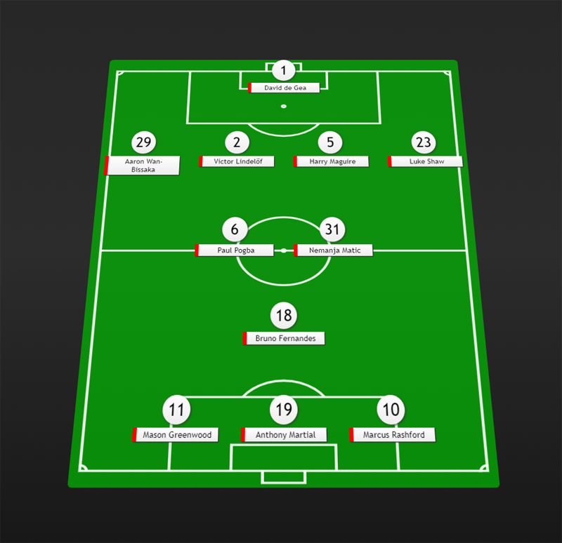

# Генератор футбольных составов

Проект позволяет отображать в браузере схематический состав футбольного клуба.

Для работы необходимо установить любой локальный сервер. Я советую установить [Nodejs](https://nodejs.org/). Затем открый командную строку и перейти в папку с проектом. Выполнить сначала команду `npm i`, а затем `npm start`. Теперь проект доступен по адресу [http://localhost:4050/](http://localhost:4050/). Но в адресной строке необходимо обязательно указать чемпионат, команду и файл настроек состава (смотри папки `config` и `tournaments`). В данный момент есть лишь Манчестер Юнайтед в рамках АПЛ (смотри картинку ниже) и доступен по адресу [http://localhost:4050/#/EPL/mu/team/](http://localhost:4050/#/EPL/mu/team/).

